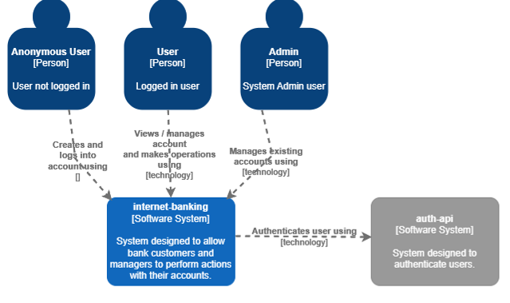
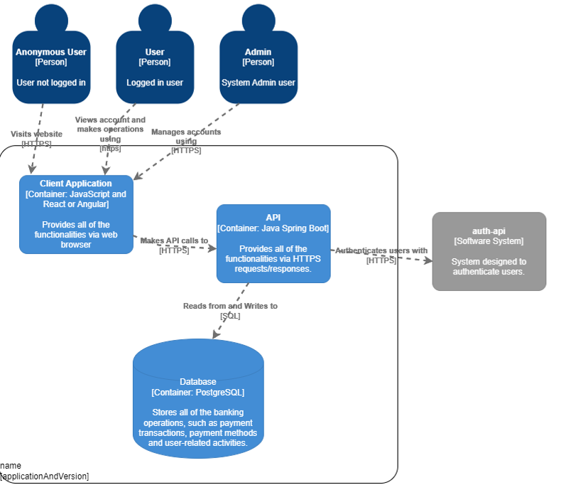
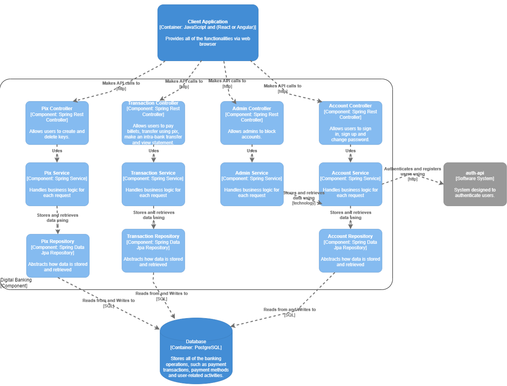
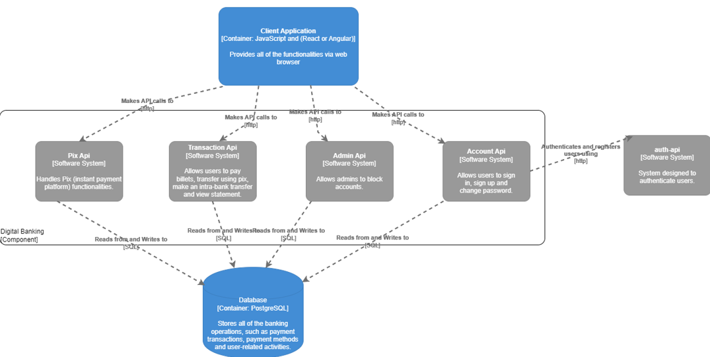
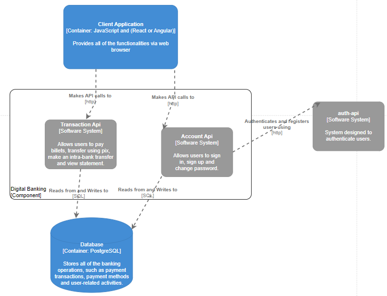

English
Portuguese

# Descrição

Internet-banking é um sistema que oferece serviços financeiros, permitindo que clientes acessem suas contas e realizem transações de maneira eficiente e segura. Através desta plataforma também são oferecidas funcionalidades administrativas para que os gestores do banco possam realizar operações de controle.
Plataforma desenvolvida com o objetivo de simular um sistema de internet-banking, com funcionalidades básicas de criação de contas, autenticação, transações, gerenciamento de chaves pix, consulta de extrato e gerenciamento de contas. Utilizando tecnologias relevantes, como Spring boot, JWT, Docker, etc.

## Resumo funcionalidades

O sistema digital-banking deve permitir:

- Criação e acesso autenticado de contas
- Transações de diferentes tipos (entre contas, pix e pagamento de boletos)
- Gerenciamento de chaves pix
- Consulta de extrato
- Gerenciamento de conta (usuário e admin)

## C4

### 1- (Context)

### 2 - (Containers)

### 3 - (Components) internet-banking como monolito

### 3 - (Components) internet-banking como microserviços

### Services:

- **Auth API**
- **Account Api**
- **Transaction Api**

### Technologies / Dependencies:

- **Common**:
  Docker
  Java 17
  Spring Boot 3.2.5
  Spring Web
  Spring Data JPA
  PostgreSQL Driver
  Lombok
  Swagger UI
  Validation

- **Auth API**:
  Spring Security
  JWT https://github.com/auth0/java-jwt
  H2 Database

### Docker setup

run `docker-compose up -d --build` to start the services

change ports:

## Use Cases

1. **[Usuário] Criar conta**

   - Descrição: usuário deve poder criar uma conta.
   - Pré-condições: -
   - Pós-condições: usuário estará autenticado e apto a realizar operações sobre a sua conta.

2. **[Usuário] Logar no sistema**

   - Descrição: usuário fornece seus dados (agência, conta e senha)
   - Pré-condições: conta deve estar cadastrada
   - Pós-condições: usuário estará autenticado e apto a realizar operações sobre a sua conta. \*[Usuário-Conta | Admin]
     - Pré-condição: deve estar logado

3. **[Usuário-Conta] Pagar boleto**

   - Descrição: usuário deve poder fornecer um código de boleto para pagamento.
   - Pré-condições: usuário deve possuir saldo suficiente na conta.
   - Pós-condições: saldo da conta deve estar atualizado corretamente; transação deve estar registrada.

4. **[Usuário-Conta] Transferir para outra conta**

   - Descrição: usuário deve poder fornecer os dados de outra conta (no mesmo banco) e transferir a quantia necessária.
   - Pré-condições: usuário deve estar logado, possuir saldo suficiente na conta e a conta de recebimento deve existir.
   - Pós-condições: saldos das contas de envio e recebimento devem estar atualizados corretamente; transação deve estar registrada.

5. **[Usuário-Conta] Realizar depósito**

   - Descrição: usuário deve poder depositar uma quantia em sua conta.
   - Pré-condições: usuário deve estar logado.
   - Pós-condições: saldo da conta deve estar atualizado corretamente; transação deve estar registrada.

6. **[Usuário-Conta] Consultar extrato**

   - Descrição: usuário deve poder consultar o extrato da sua conta.
   - Pré-condições: -
   - Pós-condições: -

[[titulo da aplicação]]

--

links para a parte em portugues ou ingles

- [Portuguese](#portuguese)
- [English](#english)

--

sumário com links para as seções

- descrição e propósito
- diagramas
- use cases
- serviços e dependências
- docker setup

--

[[breve descrição das funcionalidades gerais e propósito]]

[[diagrama c4]]

[[diagrama kafka]]

Aplicação para colocar estudar e colocar em prática alguns conceitos e tecnologias, entre eles:
Projeto de Arquitetura e documentação (C4)
[[explicar brevemente o que é o C4 e como foi utilizado no projeto, assim como para projetar o kafka]]

Docker
[[explicar brevemente como foi setado o dockerfile para cada serviço e então o compose para subir todos os serviços juntos]]

Microserviços
[[explicar brevemente a escolha por microserviços e como foi feita a divisão dos serviços e detalhes como divisão ou não de dtos]]

Kafka
[[explicar brevemente o funcionamento do kafka e porque foi aplicado]]

Design Patterns (Builder)
[[mostrar brevemente como o design pattern builder foi apliacado, exemplo que foi feito na mão, com @Builder do lombok e também
sem builder, para mostrar a diferença e a facilidade que o builder traz]]

Comunicação entre serviços (OpenFeign e WebClient)
[[mostrar exemplo de código de comunicação entre serviços com OpenFeign e WebClient]]

Testes unitários (Mockito, Spy, MockMvc)
[[explicar porque surgiu a necessidade do spy, mostrar o uso do mockmvc para testar as controllers e explicar o uso do mockito para mockar objetos]]

Spring Security - JWT
[[explicar brevemente o funcionamento da auth-api e a geração de token jwt (boilerplate)]]

--

[[rascunho dos principais use cases]]

--

[[serviços e dependências]]

--

[[docker setup]]
