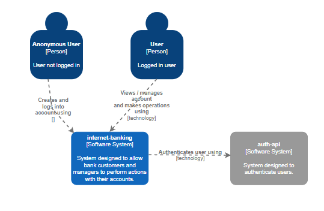
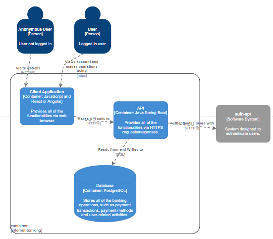
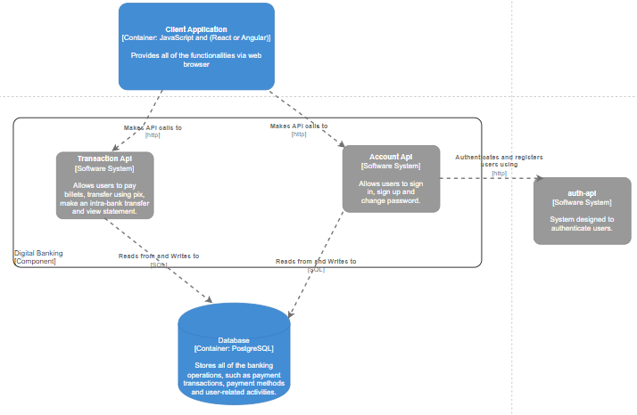
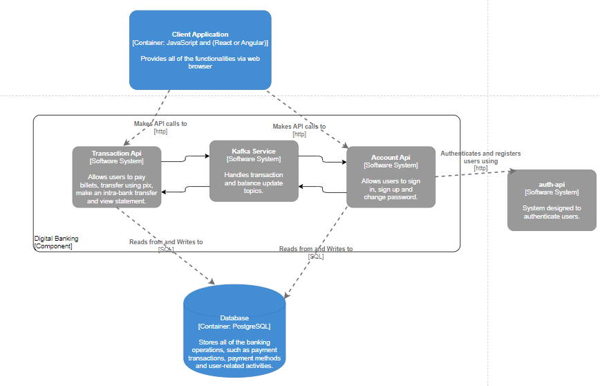

Internet Banking

## Sumário

- [Descrição e propósito](#descrição-e-propósito)
- [Diagramas](#diagramas)
- [Use cases](#use-cases)
- [Serviços e dependências](#serviços-e-dependências)
- [Setup](#setup)

## Descrição e propósito

Este projeto tem como objetivo a implementação simplificada de algumas funcionalidades de um sistema de internet banking. O sistema deve permitir que usuários possam criar contas, logar no sistema, pagar boletos, transferir para outras contas, realizar depósitos e consultar extratos.

O propósito é aprender e praticar conceitos de arquitetura, desenvolvimento em microserviços com Java Spring Boot, uso de Docker, mensageria, etc.

Alguns dos tópicos estudados

- **Docker**: foi criado um dockerfile para cada serviço, e um docker-compose para subir todos os serviços juntos. Dessa maneira é possível subir o ambiente de desenvolvimento com um único comando, de maneira rápida e isolada, sem a necessidade de instalar dependências no ambiente local.

- **Microserviços**: a aplicação foi dividida em 4 serviços: Auth API, Account API, Transaction API e Kafka Service.
  A divisão foi feita a fim de separar as responsabilidades de cada serviço, de maneira a facilitar a manutenção e escalabilidade. Foi utilizado o OpenFeign e WebClient para comunicação entre os serviços.
  A divisão de dtos é um desafio, pois ao mesmo tempo que é necessário manter o baixo acoplamento, também é preciso viabilizar a comunicação entre os serviços.

- **Kafka**: dentro do contexto da aplicação se faz necessária a comunicação assíncrona, dado o cenário de transações bancárias. Nesse sentido foi utilizado o kafka, permitindo a produção e consumo de mensagens em tópicos, ajudando a garantir a entrega das requisições.

- **Design Patterns (Builder)**: o builder facilita a criação de objetos com muitos atributos. Foi aplicado de maneira manual, com o @Builder do lombok e sem builder, para mostrar a diferença e a facilidade que o builder traz.

De maneira manual, exemplo com o BalanceUpdateRequest:

```java
public class BalanceUpdateRequest
private UUID payerId;
...
// a classe foi criada normalmente com o seus atributos, e com um construtor recebendo um Builder

            private BalanceUpdateRequest(Builder builder)
            this.payerId = builder.payerId;
            ...

        // uma classe Builder foi criada dentro da classe BalanceUpdateRequest, com os mesmos atributos e métodos para setar os atributos
            public static class Builder
            private UUID payerId;
            ...

            public Builder payerId(UUID payerId) {
                this.payerId = payerId;
                return this;
            }

    Então, para instanciar o objeto, é preciso apenas new BalanceUpdateRequest.Builder().Atributos().build()
```

Com o lombok, a classe é criada normalmente, e o @Builder é adicionado acima da classe, e o lombok se encarrega de criar o Builder e os métodos para setar os atributos.
Para instanciar é preciso apenas `new BalanceUpdateRequest().builder().Atributos().build()`

Sem o builder é preciso passar todos os atributos no construtor, dependendo, por exemplo, da ordem dos atributos, e se algum atributo for opcional, é preciso criar um construtor para cada combinação de atributos.

- **Comunicação entre serviços (OpenFeign e WebClient)**: foi utilizado o OpenFeign e WebClient para comunicação entre os serviços. O OpenFeign é uma biblioteca que funciona por meio de interfaces, tornando as requisições de comunicação mais simples. O WebClient requer uma maior configuração, aplicado como uma alternativa.

- **Testes unitários (Mockito, Spy, MockMvc)**: foi utilizado o Mockito para mockar objetos e métodos, o Spy para realmente testar
  as implementações. O MockMvc foi utilizado para gerar requisições de teste para as controllers.

- **Spring Security - JWT**: foi utilizado o Spring Security para autenticação e autorização, e o JWT para geração de tokens.
  A ideia da aplicação é ter um serviço (Auth API) responsável por gerenciar os usuários a nível de autenticação, gerando
  um token que possa ser utilizado para acessar os outros serviços.

## Diagramas

### 1- (Context) - Representação geral do sistema, considerando as interações de usuários.



### 2 - (Containers) - Detalhamento do sistema, com divisões em aplicações e detalhamento de possíveis tecnologias.



### 3 - (Components) - Detalhamento dos containers, apresentando melhor as responsaiblidades e interações.



### 3 - (Components com Kafka) - Inclusão do kafka para a comunicação entre os microserviços que justificam o uso de comunicação assíncrona.



## Ideias de use cases (funcionalidades) usados como base para o desenvolvimento

1. **[Usuário] Criar conta**

   - Descrição: usuário deve poder criar uma conta.
   - Pré-condições: -
   - Pós-condições: usuário estará autenticado e apto a realizar operações sobre a sua conta.

2. **[Usuário] Logar no sistema**

   - Descrição: usuário fornece seus dados (agência, conta e senha)
   - Pré-condições: conta deve estar cadastrada
   - Pós-condições: usuário estará autenticado e apto a realizar operações sobre a sua conta. \*[Usuário-Conta | Admin]
     - Pré-condição: deve estar logado

3. **[Usuário-Conta] Pagar boleto**

   - Descrição: usuário deve poder fornecer um código de boleto para pagamento.
   - Pré-condições: usuário deve possuir saldo suficiente na conta.
   - Pós-condições: saldo da conta deve estar atualizado corretamente; transação deve estar registrada.

4. **[Usuário-Conta] Transferir para outra conta**

   - Descrição: usuário deve poder fornecer os dados de outra conta (no mesmo banco) e transferir a quantia necessária.
   - Pré-condições: usuário deve estar logado, possuir saldo suficiente na conta e a conta de recebimento deve existir.
   - Pós-condições: saldos das contas de envio e recebimento devem estar atualizados corretamente; transação deve estar registrada.

5. **[Usuário-Conta] Realizar depósito**

   - Descrição: usuário deve poder depositar uma quantia em sua conta.
   - Pré-condições: usuário deve estar logado.
   - Pós-condições: saldo da conta deve estar atualizado corretamente; transação deve estar registrada.

6. **[Usuário-Conta] Consultar extrato**

   - Descrição: usuário deve poder consultar o extrato da sua conta.
   - Pré-condições: -
   - Pós-condições: -

## Serviços e dependências

- **Tecnologias e dependências em comum**:
  Docker
  Java 17
  Spring Boot 3.2.5
  Spring Web
  Lombok
  Swagger UI - openapi
  Validation

- **Auth API**:
  Spring Security
  JWT https://github.com/auth0/java-jwt
  H2 Database
  Spring Data JPA
  PostgreSQL Driver

- **Account API e Transaction API**:
  Spring Data JPA
  PostgreSQL Driver
  OpenFeign
  WebFlux

- **Kafka Service**:
  Spring Kafka
  OpenFeign

## Setup

run `docker-compose up -d --build`
