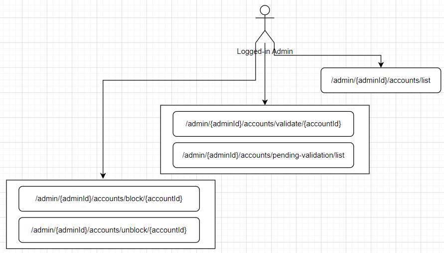

# Internet Banking

[English](#english) | [Português](#português)

## English

## Table of Contents

- [Description and Purpose](#description-and-purpose)
- [Diagrams](#diagrams)
- [Use Cases](#use-cases)
- [Services and Dependencies](#services-and-dependencies)
- [Setup](#setup)

## Description and Purpose

This project aims to implement several functionalities of an internet banking system, capable of providing access to different banking institutions. The system should allow users to create accounts, log in, pay bills, transfer to other accounts, and check statements.

The purpose is to learn and practice concepts of architecture, microservices development with Java Spring Boot, Docker, messaging, etc.

Some of the topics studied:

- **Docker**: A Dockerfile was created for each service, and a Docker Compose file to start all services together. This way, it is possible to set up the development environment with a single command, quickly and in isolation, without the need to install dependencies locally.

- **Microservices**: The application was divided into 5 services: Auth API, Account API, Transaction API, Kafka Service, and Branch API. The division was made to separate the responsibilities of each service, facilitating maintenance and scalability. OpenFeign and WebClient were used for communication between services. Managing DTOs is a challenge, as it is necessary to maintain low coupling while enabling communication between services.

- **Kafka**: In the context of the application, asynchronous communication is necessary, given the scenario of banking transactions. Kafka was used, allowing the production and consumption of messages in topics, helping to ensure request delivery.

- **Design Patterns (Builder)**: The builder pattern simplifies the creation of objects with many attributes. It was applied manually, with Lombok's @Builder and without builder, to show the difference and the ease the builder brings.

Manually, example with `BalanceUpdateRequest`:

```java
public class BalanceUpdateRequest
private UUID payerId;
...
// class created normally with its attributes, and a constructor receiving a Builder


            private BalanceUpdateRequest(Builder builder)
            this.payerId = builder.payerId;
            ...

        // Builder class created inside BalanceUpdateRequest, with the same attributes and methods to set them
            public static class Builder
            private UUID payerId;
            ...

            public Builder payerId(UUID payerId) {
                this.payerId = payerId;
                return this;
            }

      // To instantiate the object, just use:
      // new BalanceUpdateRequest.Builder().attributeMethods().build()
```

With Lombok, the class is created normally, and @Builder is added above the class. Lombok takes care of creating the Builder and the methods to set the attributes.
To instantiate, just use `new BalanceUpdateRequest().builder().attributeMethods().build()`.

Without the builder, you need to pass all the attributes in the constructor, depending, for example, on the order of the attributes, and if any attribute is optional, you need to create a constructor for each combination of attributes.

- **Service Communication (OpenFeign and WebClient)**: OpenFeign and WebClient were used for communication between services. OpenFeign is a library that works through interfaces, making communication requests simpler. WebClient requires more configuration and was applied as an alternative.

- **Unit Testing (Mockito, Spy, MockMvc)**: Mockito was used to mock objects and methods, Spy to actually test implementations, and MockMvc was used to generate test requests for controllers.

- **Spring Security - JWT**: Spring Security was used for authentication and authorization, and JWT for token generation. The idea of the application is to have a service (Auth API) responsible for managing users at the authentication level, generating a token that can be used to access other services.

- **Flyway**: Flyway was used to perform migrations, inserting data, and creating initial tables.

## Diagrams

**(C4 Model)**

### 1- (Context) - General representation of the system, considering user interactions.


### 2 - (Containers) - System detailing, with divisions in applications and detailing of possible technologies.


### 3 - (Components) - Container detailing, better presenting responsibilities and interactions. Also, including Kafka for communication between microservices that justify the use of asynchronous communication.


### Extra - Components - Idea of what the service would look like as a monolith, with its initial components.


### Kafka Studies


## Use Case Ideas (functionalities) used as a basis for development

1. **[User] Create Account**

   - Description: User should be able to create an account.
   - Pre-conditions: -
   - Post-conditions: User will be authenticated and able to perform operations on their account.

2. **[User] Log in**

   - Description: User provides their credentials (agency, account, and password).
   - Pre-conditions: The account must be registered.
   - Post-conditions: The user will be authenticated and able to perform operations on their account. \*[User-Account | Admin]
     - Pre-condition: Must be logged in.

3. **[User-Account] Pay Bill**

   - Description: User should be able to provide a bill code for payment.
   - Pre-conditions: The user must have sufficient balance in the account.
   - Post-conditions: The account balance should be updated correctly; the transaction should be recorded.

4. **[User-Account] Transfer to Another Account**

   - Description: User should be able to provide the details of another account and transfer the necessary amount.
   - Pre-conditions: The user must be logged in, have sufficient balance in the account, and the receiving account must exist.
   - Post-conditions: The balances of the sending and receiving accounts should be updated correctly; the transaction should be recorded.

5. **[User-Account] Make a Deposit**

   - Description: User should be able to deposit an amount into their account.
   - Pre-conditions: The user must be logged in.
   - Post-conditions: The account balance should be updated correctly; the transaction should be recorded.

6. **[User-Account] Check Statement**

   - Description: User should be able to check their account statement.
   - Pre-conditions: -
   - Post-conditions: -

## Services and Dependencies

- **Common Technologies and Dependencies**:
  Docker
  Java 17
  Spring Boot 3.2.5
  Spring Web
  Lombok
  Swagger UI - openapi
  Validation

- **Auth API**:
  Spring Security
  JWT https://github.com/auth0/java-jwt
  H2 Database
  Spring Data JPA
  PostgreSQL Driver

- **Account API**:
  Flyway

- **Account API and Transaction API**:
  Spring Data JPA
  PostgreSQL Driver
  OpenFeign
  WebFlux

- **Kafka Service**:
  Spring Kafka
  OpenFeign

- **Mail Service**:
  MailDev
  OpenFeign

- **Branch API**:
  Flyway

## Setup

Run `docker-compose up -d --build`

- Confirm that table creations and migrations are processed correctly at runtime.

After running the migrations (docker logs flyway), run the following commands to populate the branches table:
docker cp 'absolute-path/resources' ib-db:/tmp/resources

docker-compose exec ib-db psql -U postgres -d internet-banking -c "COPY branch(data) FROM '/tmp/resources/branch-data.json' WITH (FORMAT csv, DELIMITER E'\x02', QUOTE E'\x01');"

## Português

## Sumário

- [Descrição e propósito](#descrição-e-propósito)
- [Diagramas](#diagramas)
- [Use cases](#use-cases)
- [Serviços e dependências](#serviços-e-dependências)
- [Setup](#setup)

## Descrição e propósito

Este projeto tem como objetivo a implementação de algumas funcionalidades de um sistema de internet banking, capaz de proporcionar acesso a diferentes instituições bancárias . O sistema deve permitir que usuários possam criar contas, logar no sistema, pagar boletos, transferir para outras contas e consultar extratos.

O propósito é aprender e praticar conceitos de arquitetura, desenvolvimento em microserviços com Java Spring Boot, uso de Docker, mensageria, etc.

Alguns dos tópicos estudados

- **Docker**: foi criado um dockerfile para cada serviço, e um docker-compose para subir todos os serviços juntos. Dessa maneira é possível subir o ambiente de desenvolvimento com um único comando, de maneira rápida e isolada, sem a necessidade de instalar dependências no ambiente local.

- **Microserviços**: a aplicação foi dividida em 5 serviços: Auth API, Account API, Transaction API, Kafka Service e Branch API. A divisão foi feita a fim de separar as responsabilidades de cada serviço, de maneira a facilitar a manutenção e escalabilidade. Foi utilizado o OpenFeign e WebClient para comunicação entre os serviços. A divisão de dtos é um desafio, pois ao mesmo tempo que é necessário manter o baixo acoplamento, também é preciso viabilizar a comunicação entre os serviços.

- **Kafka**: dentro do contexto da aplicação se faz necessária a comunicação assíncrona, dado o cenário de transações bancárias. Nesse sentido foi utilizado o kafka, permitindo a produção e consumo de mensagens em tópicos, ajudando a garantir a entrega das requisições.

- **Design Patterns (Builder)**: o builder facilita a criação de objetos com muitos atributos. Foi aplicado de maneira manual, com o @Builder do lombok e sem builder, para mostrar a diferença e a facilidade que o builder traz.

De maneira manual, exemplo com o BalanceUpdateRequest:

```java
public class BalanceUpdateRequest
private UUID payerId;
...
// a classe foi criada normalmente com o seus atributos, e com um construtor recebendo um Builder

            private BalanceUpdateRequest(Builder builder)
            this.payerId = builder.payerId;
            ...

        // uma classe Builder foi criada dentro da classe BalanceUpdateRequest, com os mesmos atributos e métodos para setar os atributos
            public static class Builder
            private UUID payerId;
            ...

            public Builder payerId(UUID payerId) {
                this.payerId = payerId;
                return this;
            }

    Então, para instanciar o objeto, é preciso apenas new BalanceUpdateRequest.Builder().Atributos().build()
```

Com o lombok, a classe é criada normalmente, e o @Builder é adicionado acima da classe. O lombok se encarrega de criar o Builder e os métodos para setar os atributos.
Para instanciar é preciso apenas `new BalanceUpdateRequest().builder().Atributos().build()`.

Sem o builder, todos os atributos devem ser passados no construtor, precisando, por exemplo, prestar atenção à ordem dos atributos, e se algum deles for opcional, será necessário um construtor para cada combincação de atributos.

- **Comunicação entre serviços (OpenFeign e WebClient)**: foi utilizado o OpenFeign e WebClient para comunicação entre os serviços. O OpenFeign é uma biblioteca que funciona por meio de interfaces, tornando as requisições de comunicação mais simples. O WebClient requer uma maior configuração, aplicado como uma alternativa.

- **Testes unitários (Mockito, Spy, MockMvc)**: foi utilizado o Mockito para mockar objetos e métodos, o Spy para realmente testar as implementações. O MockMvc foi utilizado para gerar requisições de teste para as controllers.

- **Spring Security - JWT**: foi utilizado o Spring Security para autenticação e autorização, e o JWT para geração de tokens. A ideia da aplicação é ter um serviço (Auth API) responsável por gerenciar os usuários a nível de autenticação, gerando um token que possa ser utilizado para acessar os outros serviços.

- **Flyway**: foi utilizado o flyway para realizar migrations, inserindo dados e criando tabelas iniciais.

## Diagramas

**(Modelo C4)**

### 1- (Context) - Representação geral do sistema, considerando as interações de usuários.


### 2 - (Containers) - Detalhamento do sistema, com divisões em aplicações e detalhamento de possíveis tecnologias.


### 3 - (Components) - Detalhamento dos containers, apresentando melhor as responsaiblidades e interações. Também, inclusão do kafka para a comunicação entre os microserviços que justificam o uso de comunicação assíncrona.


### Extra - Components - Ideia de como seria o serviço como um monolito, com seus componentes iniciais.


### Estudos do Kafka


## Ideias de use cases (funcionalidades) usados como base para o desenvolvimento

1. **[Usuário] Criar conta**

   - Descrição: usuário deve poder criar uma conta.
   - Pré-condições: -
   - Pós-condições: usuário estará autenticado e apto a realizar operações sobre a sua conta.

2. **[Usuário] Logar no sistema**

   - Descrição: usuário fornece seus dados (agência, conta e senha)
   - Pré-condições: conta deve estar cadastrada
   - Pós-condições: usuário estará autenticado e apto a realizar operações sobre a sua conta. \*[Usuário-Conta | Admin]
     - Pré-condição: deve estar logado

3. **[Usuário-Conta] Pagar boleto**

   - Descrição: usuário deve poder fornecer um código de boleto para pagamento.
   - Pré-condições: usuário deve possuir saldo suficiente na conta.
   - Pós-condições: saldo da conta deve estar atualizado corretamente; transação deve estar registrada.

4. **[Usuário-Conta] Transferir para outra conta**

   - Descrição: usuário deve poder fornecer os dados de outra conta e transferir a quantia necessária.
   - Pré-condições: usuário deve estar logado, possuir saldo suficiente na conta e a conta de recebimento deve existir.
   - Pós-condições: saldos das contas de envio e recebimento devem estar atualizados corretamente; transação deve estar registrada.

5. **[Usuário-Conta] Realizar depósito**

   - Descrição: usuário deve poder depositar uma quantia em sua conta.
   - Pré-condições: usuário deve estar logado.
   - Pós-condições: saldo da conta deve estar atualizado corretamente; transação deve estar registrada.

6. **[Usuário-Conta] Consultar extrato**

   - Descrição: usuário deve poder consultar o extrato da sua conta.
   - Pré-condições: -
   - Pós-condições: -

## Serviços e dependências

- **Tecnologias e dependências em comum**:
  Docker
  Java 17
  Spring Boot 3.2.5
  Spring Web
  Lombok
  Swagger UI - openapi
  Validation

- **Auth API**:
  Spring Security
  JWT https://github.com/auth0/java-jwt
  H2 Database
  Spring Data JPA
  PostgreSQL Driver

- **Account API**:
  Flyway

- **Account API e Transaction API**:
  Spring Data JPA
  PostgreSQL Driver
  OpenFeign
  WebFlux

- **Kafka Service**:
  Spring Kafka
  OpenFeign

- **Mail Service**:
  MailDev
  OpenFeign

- **Branch API**:
  Flyway

## Setup

run `docker-compose up -d --build`

- Confirmar que as criações de tabelas e migrations são processadas corretamente em tempo de execução.

Após a execução das migrations (docker logs flyway), executar os comandos a seguir para popular a tabela de agências:
docker cp 'path-absoluto/resources' ib-db:/tmp/resources

docker-compose exec ib-db psql -U postgres -d internet-banking -c "COPY branch(data) FROM '/tmp/resources/branch-data.json' WITH (FORMAT csv, DELIMITER E'\x02', QUOTE E'\x01');"

## Anonymous User (Usuário Anônimo)


## Logged-in User (Usuário Logado)


## Anonymous Admin (Admin Anônimo)


## Logged-in Admin (Admin Logado)

